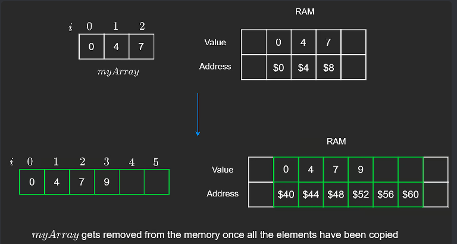
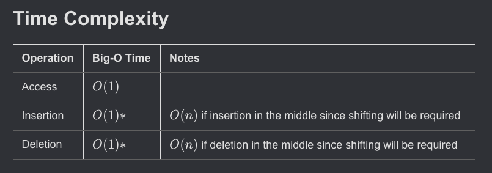

1. **What is a Dynamic Array?**
   - A dynamic array is an array that can change its size as you add more elements. Unlike static arrays (which have a fixed size), dynamic arrays can grow as needed.

2. **No Need to Specify Size:**
   - When you create a dynamic array, you don’t have to decide how big it should be. It automatically grows when more space is needed.

3. **Used in Popular Languages:**
   - In programming languages like **JavaScript** and **Python**, the default arrays are dynamic. This means they automatically handle growing when you add more elements.

4. **Initial Size in Some Languages:**
   - In some languages like **Java** or **C#**, dynamic arrays start with a small default size (e.g., 10 in Java, 4 in C#). When more space is needed, the array automatically resizes during runtime.

5. **Resizing Happens Automatically:**
   - When the array fills up, the system resizes the array behind the scenes, so you don’t have to worry about running out of space.

---

## Dynamic Arrays Insertion

- When we add an element to a dynamic array, we look for the next available empty spot and put the element there.
- In this example, the array starts with a size of 3, meaning it can hold 3 elements.
- As we keep adding elements, eventually the array will run out of space because it can only hold 3 elements.

```python
# Insert n in the last position of the array
def pushback(self, n):
    if self.length == self.capacity:
        self.resize()

    # insert at next empty position
    self.arr[self.length] = n
    self.length += 1
```


---

## Dynamic Arrays Resizing

1. **Dynamic Array Behavior:**
   - A dynamic array can grow in size, so you can keep adding elements.
   - When the array is full, a new, bigger array (twice the size of the original) is created.
   - All elements from the original array are copied into the new array.

2. **Resize Process:**
   - When the array resizes, the old array is discarded (deallocated), and the new, larger array is used.

3. **Time Complexity (Amortized Time):**
   - Amortized time complexity is the average time taken per operation over a sequence of operations.
   - On average, adding an element takes constant time, or **O(1)**. This is called "amortized" time.
   - Resizing the array takes more time, **O(n)**, because it involves copying all the elements, but this doesn’t happen every time you add an element.
   - Because resizing doesn’t happen often, the average time per addition remains **O(1)**.

```python
def resize(self):
    # Create new array of double capacity
    self.capacity = 2 * self.capacity
    newArr = [0] * self.capacity

    # Copy elements to newArr
    for i in range(self.length):
        newArr[i] = self.arr[i]
    self.arr = newArr
```



---

## Why double the capacity?

1. **Start Small, Double the Size**:
   - You start with a small array of size 1.
   - You add elements, and when the array is full, you double its size.
   - For example, you add 5, double the array to size 2 to add 6, then double it again to size 4 to add 7 and 8, and double once more to size 8 to add 9, 10, 11, and 12.

2. **Growth Pattern**:
   - The array size grows like this: 1 → 2 → 4 → 8.
   - Each time it fills up, the space is doubled.

3. **Number of Operations**:
   - To reach an array size of 8, you perform a total of 15 operations (1 + 2 + 4 + 8).
   - These operations include both adding elements and resizing the array.

4. **Last Term Dominates**:
   - The last term in the series (in this case, 8) is always larger than the sum of all the previous terms (1 + 2 + 4 = 7).
   - Adding the last term (8) to the sum of the previous terms (7), gives the total operations (15).

5. **Time Complexity Formula**:
   - For an array size of *n*, it will take at most 2n operations to create the array. (n operation of insertion and n operation of copying)
   - This belongs to time complexity **O(n)** (Big O notation).

6. **Inserting Elements**:
   - The time complexity for inserting *n* elements into a dynamic array is **O(n)**.
   - However, the average time to insert a single element is **O(1)** (amortized time complexity).

7. **Asymptotic Analysis**:
   - Time complexity looks at how the runtime grows as the input size increases.
   - We usually ignore constants (like 2 in **O(2n)**) because the important part is how the runtime grows, not the exact number.

---

## Other Operation

1. **Inserting or removing an element in the middle** of a dynamic array is similar to doing it in a static array.

2. **When inserting**, we need to **shift elements to the right** to make space for the new element.

3. **When removing**, we need to **shift elements to the left** to fill the gap where the element was removed.

4. This **shifting of elements** takes **O(n) time**, where **n** is the number of elements in the array.
 d

