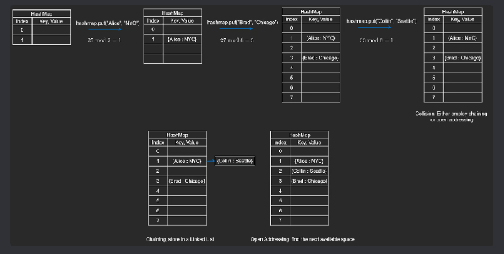

## **Hash Map Implementation**:

- It's not common to be asked to implement a hash map from scratch in interviews, but knowing how it works is helpful for algorithms, system design, and distributed systems.

---

2. **Hash Map and Arrays**:
   - A hash map is often implemented using an array.
   - Even when the hash map is empty, the array is not of size zero.

3. **Key-Value Pairs**:
   - For example, the hash map may have key-value pairs like:
     - "Alice" → "NYC"
     - "Brad" → "Chicago"
     - "Collin" → "Seattle"

4. **Hash Function**:
   - To store data in constant time (O(1)), we use a **hash function**.
   - The hash function takes the key (e.g., the name "Alice") and converts it into an integer.

5. **Index Calculation**:
   - This integer is used as an index to store the key-value pair in the array.
   - The hash function ensures the index is valid and prevents different keys from going to the same index.

6. **Consistency**:
   - The same string (key) will always produce the same integer, making sure we can easily find the stored value later.

---

### **Insertion and Hashing**

1. **Using "Alice" as a Key**:
   - To convert the string "Alice" into a number, the **hash function** uses the ASCII code of each character.
   - It adds the ASCII codes of all the characters in "Alice" together.

2. **Handling Large Numbers**:
   - The sum of ASCII codes might be too large for the array, so we use the **modulo operator** to make sure the result fits within the array size.

3. **Example of Insertion**:
   - For example, the sum of the ASCII codes in "Alice" is 25.
   - If the array has a size of 2, we calculate: `25 % 2 = 1`.
   - This means the key "Alice" will be stored at index 1 in the array.

4. **Collisions**:
   - Since the array size is small (only 2 in this case), it’s possible that another key could also end up at index 1.
   - This is called a **collision**, and it happens when two keys are assigned the same position.
   - Collisions are common and need to be handled, but they can't be completely avoided.

---

### **Resizing and Rehashing**

### Resizing

1. **Tracking Space**:
   - We monitor the size of the array and how many spots are filled with key-value pairs.
   - When the array becomes half full, we need to resize it.

2. **Doubling the Size**:
   - To avoid running out of space, we create a new array with double the capacity.
   - This happens before the array is completely full to reduce the chances of collisions.

3. **Example**:
   - If the array size is 2 and we add "Alice" : "NYC," the array becomes half full.
   - Before adding another key, we double the size of the array to 4.

4. **Why Resize Before Insertion?**:
   - We resize the array when it's half full (not during insertion) to reduce collisions and make room for new data.

### Re-hashing

1. **What is Re-hashing?**:
   - After resizing the array, we need to reinsert all existing key-value pairs into the new array.
   - This is because the new array size changes the positions of the keys.

2. **Re-computing Positions**:
   - We use the same hash function (sum of ASCII codes % new array size) to recalculate the index for each key.
   - For example, "Alice" might stay at index 1, or it could move to a different index based on the new size.

3. **Example of Re-hashing**:
   - Let's say "Brad" converts to 27. With an array size of 4, `27 % 4 = 3`, so "Brad" is placed at index 3.
   - When we double the size to 8, we will rehash "Brad" to determine its new position in the larger array.

---
## **Collisions**
- A collision happens when two different keys are converted to the same index in an array.
- Example: The name "Collin" converts to index 1, but "Alice" is already there.
- We cannot overwrite "Alice" or just keep expanding the array, as it wastes memory.

To handle collisions, we use two main methods:

### 1. **Chaining**
- Multiple values at the same index are stored using a linked list.
- Both "Alice" and "Collin" are stored in the same spot but linked together.
- Searching and inserting can take longer if many values are stored in the same index.
- However, in general cases, it’s fast.

### 2. **Open Addressing**
- Instead of storing multiple values at one index, we search for the next empty slot.
- If index 1 is full, we check index 2, then index 3, and so on until we find a free spot.
- When searching for a key, we also check nearby slots.
- This method is more complex but works better if collisions are rare. The downside is that the array size limits how many entries we can store.

**Hashing**
- To reduce collisions, we use a hashmap size that’s a prime number.
- A prime number has fewer divisors, so it helps spread values more evenly across the array, reducing collisions.

---
