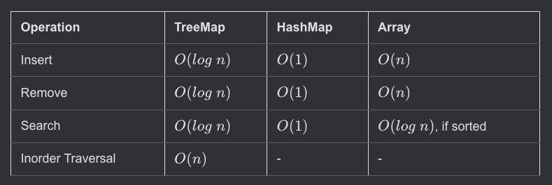

## Hash Usage

- This chapter talks about using a **HashSet** and **HashMap** in programming.
- These are ways of implementing **map** and **set** interfaces using **hashing**.

2. **Importance of Hash Maps**:

   - **HashMaps** are very important in coding interviews.
   - They are often used to solve problems where you need to find **unique values**, **count occurrences**, or check **frequency** of items.

3. **Difference between Set and Map**:
   - A **set** holds only **keys**, and it doesn’t connect them to any value.
   - A **map** holds **key-value pairs**, where each key is connected to a specific value.

#### IN Python, Dictionaries are Hash maps

---

### Average Time Complexity

- All the Time complexity below are average.

---

### Tree Maps vs Hash Maps

1. **Hash maps are not ordered**:

   - Hash maps don’t keep keys in a specific order.
   - If you want to go through the keys in order, you first need to sort them, which takes more time (O(n log n)).
   - This is slower compared to traversing an ordered structure like a tree map (O(n)).

2. **Hash maps prevent duplicates**:

   - Each key in a hash map is unique, meaning no duplicates are allowed.
   - They store data as key-value pairs.

3. **Counting frequency with hash maps**:

   - You can use a hash map to count how many times a certain key (like a name) appears.
   - For example, in a list of names, you can count how often each name appears by storing the name as the key and its frequency (count) as the value.

4. **Example**:

   - For a list like `["alice", "brad", "collin", "brad", "dylan", "kim"]`, you can put these names into a hash map.
   - If a name already exists, you increase its count by 1; if it doesn’t, you add it to the map with a count of 1.

5. **Code explanation**:
   - The provided Python code loops through the list of names.
   - It checks if a name exists in the hash map (`countMap`). If it’s not there, it adds it with a count of 1. If it’s already there, it increases the count by 1.

Here's the result of that operation:

| Name   | Frequency |
| ------ | --------- |
| Alice  | 1         |
| Brad   | 2         |
| Collin | 1         |
| Dylan  | 1         |
| Kim    | 1         |

This code efficiently counts how many times each name appears in the list.

---

## Time Complexity of above counting algo

### Time Complexity:

1. **Tree map insertion**:

   - Inserting elements into a tree map takes **O(log n)** time for each element.
   - If you have **n** elements in total, inserting all of them would take **O(n log n)** time.

2. **Hash map insertion**:
   - Inserting elements into a hash map takes **O(1)** (constant) time for each element on average.
   - So, for **n** elements, the total time is **O(n)**, which is faster than using a tree map.

### Space Complexity:

- The space used by a hash map is **O(n)**, where **n** is the number of unique keys (unique elements) in the array.
- This means if there are **n** unique items, the space grows linearly with **n**.

In short:

- **Time (Hash Map)**: **O(n)** – more efficient than a tree map.
- **Space (Hash Map)**: **O(n)** – space used depends on the number of unique keys in the array.
